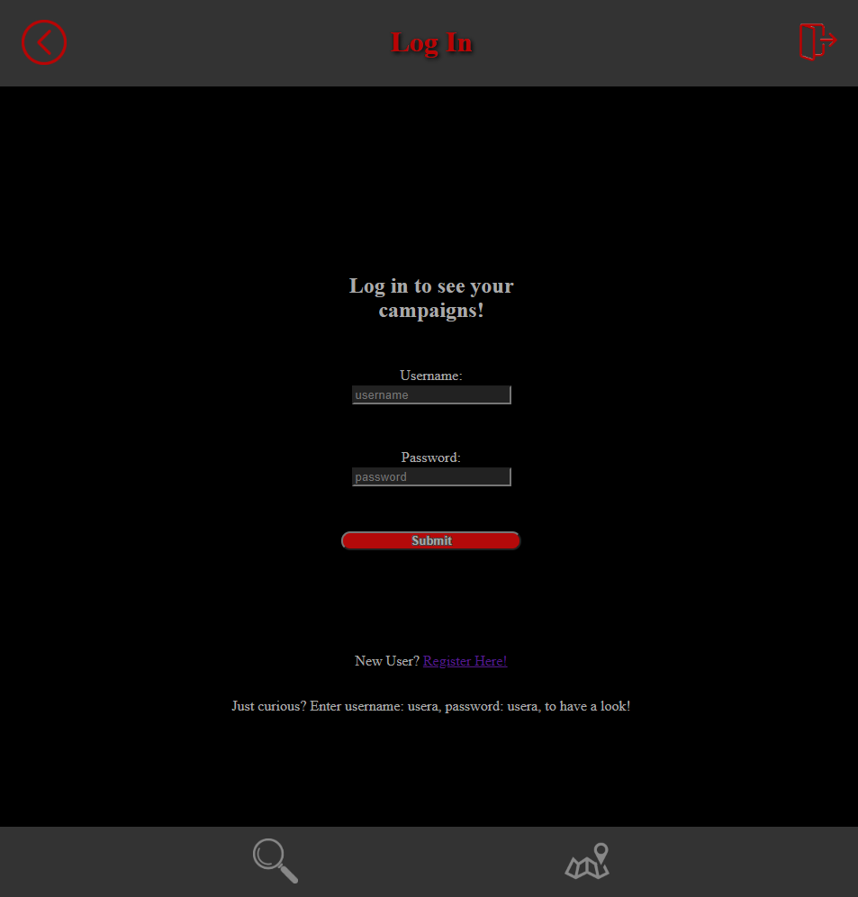

# BattleSource
## Client

### Live Project
https://battlesource.vercel.app/

### Summary
This is an application intended to be used as a companion tool for Dungeons and Dragons 5e. The bestiary consists of the information from the 5e Monster Manual, and is searchable by the name, type/alignment, and challenge rating fields.

The encounter builder is filtered by the application user login, and will automatically populate encounters with characters associated with that campaign within the encounter detail pages. In addition, the encounter detail pages auto-sort based upon initative order, so no need to make a seperate list!

FYI, the information in the encounter builder may contain DM privileged information, and as such is intended to be used as a tool for DM's only.

### Technology
This application uses a partner API with a postgresql/express database. The client side features react source code with vanilla css styling methods.

### Screenshots

